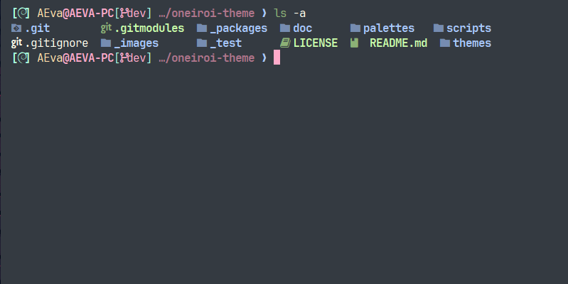
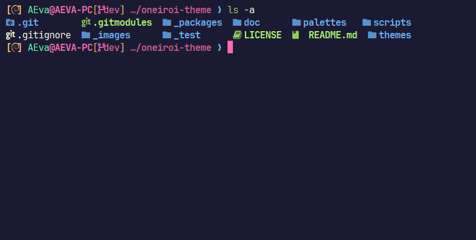

# Oneiroi theme for [Alacritty](https://alacritty.org/)

> A fantastic theme for `Alacritty`.  

<p align="center">
  
</p>

<p align="center">
  <a href="https://github.com/OneiroiTheme/alacritty/stargazers"></a>
  <a href="https://github.com/OneiroiTheme/alacritty/issues"></a>
  <a href="https://github.com/OneiroiTheme/alacritty/contributors"></a>
</p>

## Themes available

- oneiroi dream

<p align="center">
  
</p>

- oneiroi melatonin

<p align="center">
  
</p>

## Installation

Compile and install:

1. Clone this repository

    ```bash
    git clone "https://github.com/OneiroiTheme/alacritty.git" ./alacritty
    cd ./alacritty
    ```

2. Import the desired config in your alacritty.toml(e.g. oneiroi-dream.toml):

    ```toml
    general.import = [ "/a/path/you/choose/oneiroi-dream.toml" ]
    ```

Hello fantasy world!🎉
